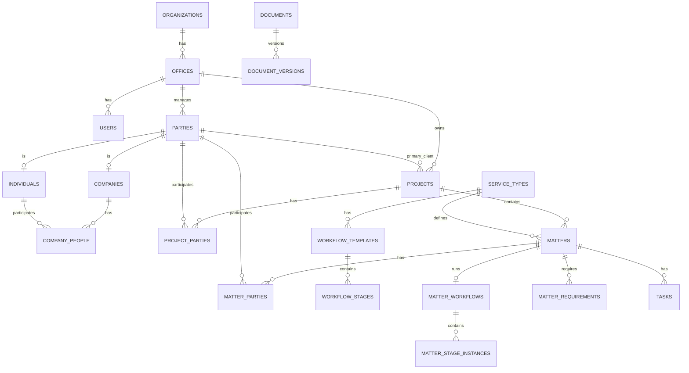
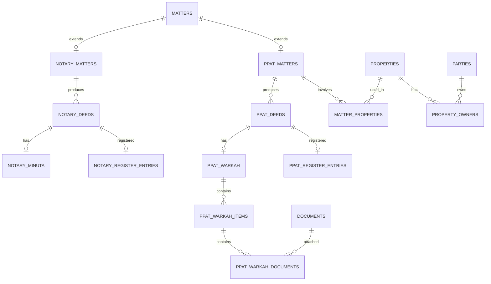

# Notary & PPAT Office Management System
## Database & ERD Specification — v1.0

## 1. Database Principles

Use PostgreSQL.

Goals:

- clear Notary and PPAT separation;
- reusable shared entities;
- bilingual master data;
- workflow versioning;
- document versioning;
- historical preservation;
- strong audit trail;
- soft deletion where appropriate;
- locking of finalized legal records;
- multi-office-ready design;
- scalable indexing and search.

### Engine Configuration

```text
Engine              PostgreSQL 18.x (latest supported minor release)
Database encoding   UTF-8
Timestamp storage   UTC
Default office tz   Asia/Jakarta
Local dev database  notary_ppat_office
```

Timestamps are stored in UTC and converted for display using the office or user timezone.

Do not pin a specific PostgreSQL minor release as a permanent application requirement.

---

## 2. Primary Keys

Use ULID for business-domain tables unless documented otherwise.

Do not use legal numbers as primary keys.

---

## 3. Core Tables

### organizations

```text
id
name
legal_name
timezone
default_locale
is_active
created_at
updated_at
```

V1 runs **one active Organization per deployment** (D-026). The table stays
plural so the schema does not have to change if that ever evolves, but the
application offers no routine way to create a second one, and there is no
tenant middleware, tenant scope, or organization selector.

### offices

```text
id
organization_id
code
name
address
city
province
postal_code
phone
email
timezone
is_active
created_at
updated_at
```

Every Office belongs to exactly one Organization; `organization_id` is required
(D-027). Offices are retired with `is_active`, not deleted.

---

## 4. Users

### users

```text
id
office_id
name
email
email_verified_at
phone
password
preferred_locale
is_active
last_login_at
created_at
updated_at
deleted_at
```

`office_id` is **required for operational users** (D-027). Each user has one
primary Office in V1; there is no `user_offices` membership table. Access
across offices is expressed through permissions and Data Scope, not through
multiple memberships.

`email_verified_at` is nullable and is retained as framework-compatible
account-security infrastructure. Its presence does **not** mean M1 requires
email verification (D-031). It was previously absent from this list while
present in the schema; the divergence is resolved in favour of keeping the
column.

Primary keys here are ULID (`CLAUDE.md` section 11, section 2 above). Spatie's
`roles` and `permissions` keep their package-native integer keys, while the
package morph column `model_id` is ULID to match `users.id` — see D-023.

---

## 5. Roles & Permissions

Use Spatie Laravel Permission base tables.

Additional table:

### role_permission_scopes

```text
id
role_id
permission_id
scope
created_at
updated_at
```

Scope:

```text
OWN
ASSIGNED
TEAM
OFFICE
ALL
```

Optional:

### user_permission_overrides

```text
id
user_id
permission_id
effect
scope
expires_at
created_by
created_at
```

Effect:

```text
ALLOW
DENY
```

This is the **only** per-user authorization exception mechanism the product
exposes (D-029). Spatie's own direct user-permission assignment must not be
surfaced in any management UI or API: two competing per-user grant mechanisms
would make precedence ambiguous. The package's `model_has_permissions` table
stays in place as package infrastructure and is not customized or dropped.

Resolution order, scope combination, and expiry semantics are locked in D-028
and D-029.

---

## 6. Party Model

### parties

```text
id
office_id
party_type
display_name
primary_phone
primary_email
status
created_at
created_by
updated_at
updated_by
deleted_at
```

Party type:

```text
INDIVIDUAL
COMPANY
```

### individuals

```text
party_id
full_name
prefix
suffix
nik
npwp
birth_place
birth_date
gender
occupation
nationality
marital_status
address
village
district
city
province
postal_code
created_at
updated_at
```

### companies

```text
party_id
legal_name
short_name
entity_type
registration_number
tax_id
address
village
district
city
province
postal_code
phone
email
status
created_at
updated_at
```

Entity type:

```text
PT
CV
YAYASAN
PERKUMPULAN
KOPERASI
FIRMA
OTHER
```

### company_people

```text
id
company_party_id
individual_party_id
relationship_type
position_name
ownership_percentage
effective_from
effective_until
is_current
created_at
updated_at
```

Relationship type:

```text
DIRECTOR
COMMISSIONER
SHAREHOLDER
AUTHORIZED_PERSON
BENEFICIAL_OWNER
```

---

## 7. Projects

### projects

```text
id
office_id
project_number
title
description
primary_client_party_id
status
priority
pic_user_id
opened_at
target_completion_date
completed_at
created_by
created_at
updated_by
updated_at
deleted_at
```

Project status:

```text
OPEN
IN_PROGRESS
WAITING
ON_HOLD
COMPLETED
CANCELLED
ARCHIVED
```

### project_parties

```text
id
project_id
party_id
role_code
is_primary
notes
created_at
created_by
```

Example role codes:

```text
CLIENT
CONTACT_PERSON
BUYER
SELLER
AUTHORIZED_PERSON
OTHER
```

---

## 8. Service Types

### service_types

```text
id
office_id
code
domain
name_id
name_en
description_id
description_en
legal_term
preserve_legal_term
default_duration_days
is_active
sort_order
created_at
updated_at
```

Domain:

```text
NOTARY
PPAT
```

---

## 9. Matters

### matters

```text
id
office_id
project_id
service_type_id
matter_number
domain
title
status
current_stage_id
priority
pic_user_id
opened_at
target_completion_date
completed_at
notes
created_by
created_at
updated_by
updated_at
deleted_at
```

Matter status:

```text
OPEN
IN_PROGRESS
WAITING
ON_HOLD
COMPLETED
CANCELLED
ARCHIVED
```

### matter_parties

```text
id
matter_id
party_id
role_code
sequence_no
represented_by_party_id
notes
created_at
created_by
updated_at
```

Example role codes for a PPAT transfer matter:

```text
SELLER
BUYER
SELLER_SPOUSE
BUYER_SPOUSE
AUTHORIZED_PERSON
WITNESS
```

Example role codes for a corporate Notarial matter:

```text
DIRECTOR
COMMISSIONER
SHAREHOLDER
ATTENDEE
AUTHORIZED_PERSON
```

Role codes are stored on the relationship, never permanently on the Party record.

---

## 10. Notary and PPAT Extensions

### notary_matters

```text
matter_id
deed_category
requires_minuta
requires_register_entry
notes
created_at
updated_at
```

### ppat_matters

```text
matter_id
land_office_region
tax_processing_required
registration_required
notes
created_at
updated_at
```

---

## 11. Workflow

### workflow_templates

```text
id
office_id
service_type_id
code
name_id
name_en
version
is_default
is_active
created_at
updated_at
```

### workflow_stages

```text
id
workflow_template_id
code
name_id
name_en
sequence_no
target_days
requires_approval
approval_permission
is_start_stage
is_completion_stage
created_at
updated_at
```

### matter_workflows

```text
id
matter_id
workflow_template_id
workflow_version
started_at
completed_at
created_at
```

### matter_stage_instances

```text
id
matter_workflow_id
workflow_stage_id
stage_code
stage_name_snapshot_id
stage_name_snapshot_en
sequence_no
status
started_at
completed_at
assigned_user_id
approved_at
approved_by
created_at
updated_at
```

Stage status:

```text
PENDING
ACTIVE
COMPLETED
SKIPPED
BLOCKED
```

### matter_stage_history

```text
id
matter_id
from_stage_code
to_stage_code
changed_by
reason
changed_at
```

---

## 12. Document Requirements

### service_document_requirements

```text
id
service_type_id
code
name_id
name_en
description_id
description_en
party_role_code
is_required
required_before_stage_code
sort_order
is_active
created_at
updated_at
```

### matter_requirements

```text
id
matter_id
requirement_template_id
requirement_code
name_snapshot_id
name_snapshot_en
party_id
status
verified_at
verified_by
notes
created_at
updated_at
```

Requirement status:

```text
MISSING
RECEIVED
UNDER_REVIEW
VERIFIED
REJECTED
NOT_APPLICABLE
```

---

## 13. Documents

### documents

```text
id
office_id
document_number
document_type_code
title
status
is_sensitive
document_date
expiry_date
notes
created_by
created_at
updated_by
updated_at
archived_at
archived_by
deleted_at
```

Document status:

```text
DRAFT
RECEIVED
UNDER_REVIEW
VERIFIED
FINAL
ARCHIVED
VOID
```

### document_versions

```text
id
document_id
version_number
storage_disk
storage_path
original_filename
stored_filename
mime_type
file_size
checksum_sha256
uploaded_by
uploaded_at
is_current
```

Never overwrite an existing version.

---

## 14. Document Relations

Recommended junction tables:

```text
party_documents
project_documents
matter_documents
property_documents
notary_deed_documents
ppat_deed_documents
matter_requirement_documents
```

Prefer explicit junction tables over overly generic polymorphic relationships where strong referential integrity is important.

---

## 15. Tasks

### tasks

```text
id
office_id
project_id
matter_id
title
description
status
priority
assigned_to
assigned_by
due_at
completed_at
completed_by
workflow_stage_instance_id
created_at
updated_at
deleted_at
```

Task status:

```text
OPEN
IN_PROGRESS
WAITING
COMPLETED
CANCELLED
```

Priority:

```text
LOW
NORMAL
HIGH
URGENT
```

### task_templates

```text
id
office_id
service_type_id
workflow_stage_id
title_id
title_en
description_id
description_en
default_assignee_role
due_days_offset
is_required
is_active
created_at
updated_at
```

### task_comments

```text
id
task_id
user_id
comment
created_at
updated_at
deleted_at
```

---

## 16. Property

### properties

```text
id
office_id
property_number
property_type
right_type
certificate_number
certificate_date
land_area
building_area
measurement_letter_number
measurement_letter_date
address
village
district
city
province
postal_code
latitude
longitude
status
created_at
created_by
updated_at
updated_by
deleted_at
```

Property type:

```text
LAND
LAND_AND_BUILDING
APARTMENT_UNIT
OTHER
```

Right type may use stable machine codes, for example:

```text
HAK_MILIK
HGB
HGU
HAK_PAKAI
STRATA_TITLE
OTHER
```

Do not translate these codes in the database.

### property_owners

```text
id
property_id
party_id
ownership_percentage
effective_from
effective_until
is_current
source_matter_id
created_at
updated_at
```

### matter_properties

```text
id
matter_id
property_id
role_code
created_at
```

Example role codes:

```text
TRANSACTION_OBJECT
COLLATERAL
RELATED_PROPERTY
```

---

## 17. Notarial Deeds

### notary_deeds

```text
id
office_id
matter_id
deed_number
deed_date
deed_type_code
title
status
draft_document_id
final_document_id
minuta_document_id
reviewed_at
reviewed_by
approved_at
approved_by
finalized_at
finalized_by
locked_at
created_at
updated_at
```

Status:

```text
DRAFT
UNDER_REVIEW
APPROVED
FINALIZED
VOID
SUPERSEDED
```

### notary_minuta

```text
id
notary_deed_id
document_id
archive_location
volume_number
bundle_number
archived_at
archived_by
release_status
notes
created_at
updated_at
```

---

## 18. PPAT Deeds

### ppat_deeds

```text
id
office_id
matter_id
deed_number
deed_date
deed_type_code
title
status
final_document_id
reviewed_at
reviewed_by
approved_at
approved_by
finalized_at
finalized_by
locked_at
created_at
updated_at
```

Possible deed codes:

```text
AJB
APHT
HIBAH
TUKAR_MENUKAR
PEMBAGIAN_HAK_BERSAMA
OTHER
```

---

## 19. Warkah

### ppat_warkah

```text
id
ppat_deed_id
status
completeness_percentage
verified_at
verified_by
finalized_at
finalized_by
archive_location
notes
created_at
updated_at
```

Status:

```text
INCOMPLETE
UNDER_REVIEW
COMPLETE
FINALIZED
ARCHIVED
```

### ppat_warkah_items

```text
id
warkah_id
requirement_code
title_id
title_en
party_id
status
sequence_no
notes
created_at
updated_at
```

### ppat_warkah_documents

```text
warkah_item_id
document_id
attached_at
attached_by
```

---

## 20. PPAT Tax Records

### ppat_tax_records

```text
id
matter_id
tax_type
party_id
tax_object_number
amount
status
payment_reference
payment_date
document_id
notes
created_at
updated_at
```

Potential type codes:

```text
BPHTB
PPH
PBB
OTHER
```

Final legal/tax behavior must be validated before production.

---

## 21. Registers

### notary_register_entries

```text
id
office_id
notary_deed_id
register_number
register_date
period_year
period_month
status
finalized_at
finalized_by
created_at
updated_at
```

### ppat_register_entries

```text
id
office_id
ppat_deed_id
register_number
register_date
period_year
period_month
status
finalized_at
finalized_by
created_at
updated_at
```

---

## 22. Protocol

### protocol_records

```text
id
office_id
domain
record_type
reference_number
period_year
storage_location
status
finalized_at
finalized_by
notes
created_at
updated_at
```

Domain:

```text
NOTARY
PPAT
```

---

## 23. Calendar

### calendar_events

```text
id
office_id
project_id
matter_id
event_type
title
description
starts_at
ends_at
location
created_by
created_at
updated_at
deleted_at
```

Event types:

```text
APPOINTMENT
SIGNING
DEADLINE
REMINDER
INTERNAL_MEETING
OTHER
```

---

## 24. Activity Timeline

### activities

```text
id
office_id
actor_user_id
activity_type
subject_type
subject_id
project_id
matter_id
description_key
metadata JSONB
created_at
```

Examples:

```text
DOCUMENT_UPLOADED
MATTER_STAGE_CHANGED
TASK_COMPLETED
DEED_APPROVED
```

---

## 25. Audit Log

### audit_logs

```text
id
office_id
actor_user_id
event
auditable_type
auditable_id
old_values JSONB
new_values JSONB
ip_address
user_agent
reason
created_at
```

No:

```text
updated_at
deleted_at
```

Audit logs are append-only.

---

## 26. Legal Terminology

### legal_terms

```text
id
office_id
code
term_id
term_en
explanation_id
explanation_en
preserve_original_term
category
is_active
created_at
updated_at
```

---

## 27. Numbering Sequences

### numbering_sequences

```text
id
office_id
code
prefix_pattern
reset_period
current_value
year
month
created_at
updated_at
```

Internal reference patterns:

| Code | Pattern | Example |
|---|---|---|
| `PROJECT` | `PRJ-{YYYY}-{SEQ:6}` | `PRJ-2026-000001` |
| `NOTARY_MATTER` | `N-{YYYY}-{SEQ:6}` | `N-2026-000001` |
| `PPAT_MATTER` | `P-{YYYY}-{SEQ:6}` | `P-2026-000001` |
| `PROPERTY` | `PROP-{SEQ:6}` | `PROP-000001` |
| `DOCUMENT` | `DOC-{YYYY}-{SEQ:6}` | `DOC-2026-000001` |

These are internal application references. Legal deed numbering follows separately
documented legal/business rules and must not be derived from these sequences.

Never generate important sequential numbers using `MAX + 1`.

---

## 28. Index Strategy

Index frequently searched fields such as:

```text
projects.project_number
matters.matter_number
notary_deeds.deed_number
ppat_deeds.deed_number
properties.certificate_number
individuals.nik
individuals.npwp
companies.tax_id
documents.document_number
```

Also index common foreign keys, status, PIC, target date, and created date columns.

---

## 29. High-Level ERD

```text
ORGANIZATION
    └── OFFICE
        ├── USERS
        ├── PARTIES
        │   ├── INDIVIDUALS
        │   └── COMPANIES
        │       └── COMPANY_PEOPLE
        ├── PROJECTS
        │   └── MATTERS
        │       ├── MATTER_PARTIES
        │       ├── WORKFLOW
        │       ├── REQUIREMENTS
        │       ├── TASKS
        │       ├── DOCUMENTS
        │       ├── NOTARY_MATTER
        │       │   └── NOTARY_DEEDS
        │       │       └── MINUTA
        │       └── PPAT_MATTER
        │           ├── PROPERTIES
        │           └── PPAT_DEEDS
        │               └── WARKAH
        ├── CALENDAR_EVENTS
        ├── ACTIVITIES
        └── AUDIT_LOGS
```

---

## 30. Mermaid ERD — Core



---

## 31. Mermaid ERD — Notary & PPAT



---

## 32. Migration Order

Recommended batches:

```text
1. organizations, offices, users, authorization
2. parties, individuals, companies, company_people
3. projects, project_parties
4. service types, workflow templates, requirements templates
5. matters, workflow instances, matter requirements
6. documents and document relations
7. tasks, calendar, activity, audit
8. properties, ownership, PPAT matter extensions
9. Notary deeds and Minuta
10. PPAT deeds and Warkah
11. registers, protocol, taxes, billing, advanced reporting
```

Do not create all future tables prematurely if the milestone does not require them.

---

## 33. Delete and Lock Strategy

Operational records may use soft delete.

Finalized legal records should generally use states such as:

```text
ARCHIVED
VOID
SUPERSEDED
CANCELLED
```

rather than destructive deletion.

Finalized records should become read-only under normal operations.

---

## 34. Notifications

### notifications

May use the Laravel notification table as its base, with additional context columns:

```text
project_id
matter_id
```

Example notification types:

```text
TASK_ASSIGNED
DOCUMENT_REQUIRED
DEED_REVIEW_REQUIRED
SIGNING_REMINDER
MATTER_OVERDUE
```

Notifications are operational data, not legal records.

---

## 35. Referential Delete Strategy

Use:

```text
RESTRICT
```

for important legal relationships.

Example:

```text
A Deed must not be deleted merely because its Matter is deleted.
```

For non-legal dependent data:

```text
CASCADE
```

may be used selectively.

This complements, and does not replace, the delete and lock strategy in section 33.

---

**Status:** Final baseline v1.0
