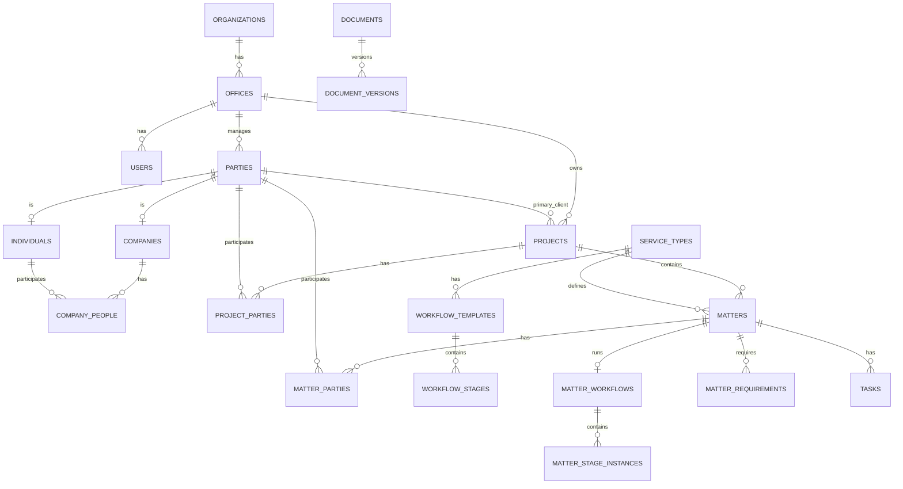
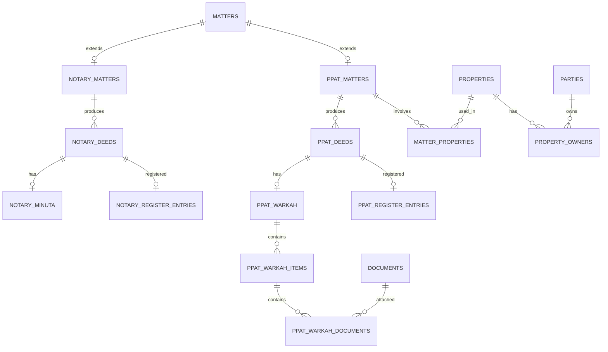

# Notary & PPAT Office Management System
## Database & ERD Specification — v1.0

## 1. Database Principles

Use PostgreSQL.

Goals:

- clear Notary and PPAT separation;
- reusable shared entities;
- bilingual master data;
- workflow versioning;
- document versioning;
- historical preservation;
- strong audit trail;
- soft deletion where appropriate;
- locking of finalized legal records;
- multi-office-ready design;
- scalable indexing and search.

### Engine Configuration

```text
Engine              PostgreSQL 18.x (latest supported minor release)
Database encoding   UTF-8
Timestamp storage   UTC
Default office tz   Asia/Jakarta
Local dev database  notary_ppat_office
```

Timestamps are stored in UTC and converted for display using the office or user timezone.

Do not pin a specific PostgreSQL minor release as a permanent application requirement.

---

## 2. Primary Keys

Use ULID for business-domain tables unless documented otherwise.

Do not use legal numbers as primary keys.

---

## 3. Core Tables

### organizations

```text
id
name
legal_name
timezone
default_locale
is_active
created_at
updated_at
```

V1 runs **one active Organization per deployment** (D-026). The table stays
plural so the schema does not have to change if that ever evolves, but the
application offers no routine way to create a second one, and there is no
tenant middleware, tenant scope, or organization selector.

### offices

```text
id
organization_id
code
name
address
city
province
postal_code
phone
email
timezone
is_active
created_at
updated_at
```

Every Office belongs to exactly one Organization; `organization_id` is required
(D-027). Offices are retired with `is_active`, not deleted.

---

## 4. Users

### users

```text
id
office_id
name
email
email_verified_at
phone
password
preferred_locale
is_active
last_login_at
created_at
updated_at
deleted_at
```

`office_id` is **required for operational users** (D-027). Each user has one
primary Office in V1; there is no `user_offices` membership table. Access
across offices is expressed through permissions and Data Scope, not through
multiple memberships.

`email_verified_at` is nullable and is retained as framework-compatible
account-security infrastructure. Its presence does **not** mean M1 requires
email verification (D-031). It was previously absent from this list while
present in the schema; the divergence is resolved in favour of keeping the
column.

Primary keys here are ULID (`CLAUDE.md` section 11, section 2 above). Spatie's
`roles` and `permissions` keep their package-native integer keys, while the
package morph column `model_id` is ULID to match `users.id` — see D-023.

---

## 5. Roles & Permissions

Use Spatie Laravel Permission base tables.

Additional table:

### role_permission_scopes

```text
id
role_id
permission_id
scope
created_at
updated_at
```

Scope:

```text
OWN
ASSIGNED
TEAM
OFFICE
ALL
```

Optional:

### user_permission_overrides

```text
id
user_id
permission_id
effect
scope
expires_at
created_by
created_at
```

Effect:

```text
ALLOW
DENY
```

This is the **only** per-user authorization exception mechanism the product
exposes (D-029). Spatie's own direct user-permission assignment must not be
surfaced in any management UI or API: two competing per-user grant mechanisms
would make precedence ambiguous. The package's `model_has_permissions` table
stays in place as package infrastructure and is not customized or dropped.

Resolution order, scope combination, and expiry semantics are locked in D-028
and D-029.

---

## 6. Party Model

> **Superseded in four places by D-081 and D-078 (M2.0).** The field lists below are the
> original blueprint. `12_M2_PARTY_ARCHITECTURE.md` section 5 is authoritative for M2 and
> departs from them deliberately:
>
> - `parties.status` — **dropped**; it competes with `deleted_at` for lifecycle authority
> - `companies.status` — **dropped**; archive is an aggregate operation
> - `companies.phone`, `companies.email` — **dropped**; duplicate `parties.primary_phone`
>   and `parties.primary_email`, and `individuals` carries no such pair
> - `company_people.is_current` — **dropped**; derivable from `effective_until`
>
> Everything else below is retained and classified in that document's section 7.

### parties

```text
id
office_id
party_type
display_name
primary_phone
primary_email
status
created_at
created_by
updated_at
updated_by
deleted_at
```

Party type:

```text
INDIVIDUAL
COMPANY
```

### individuals

```text
party_id
full_name
prefix
suffix
nik
nik_fingerprint
npwp
npwp_fingerprint
birth_place
birth_date
gender
occupation
nationality
marital_status
address
village
district
city
province
postal_code
created_at
updated_at
```

### companies

```text
party_id
legal_name
short_name
entity_type
registration_number
tax_id
tax_id_fingerprint
address
village
district
city
province
postal_code
phone
email
status
created_at
updated_at
```

**The `*_fingerprint` columns are internal metadata, added by M2.5 under D-086.** They are
`char(64)`, nullable, and carry a plain btree index that is **never unique** — see
`12_M2_PARTY_ARCHITECTURE.md` section 14 for why uniqueness is refused on both the identifier
and its fingerprint. They exist because `nik`, `npwp`, and `tax_id` use randomized encryption,
so equality search against the stored ciphertext is impossible by construction and the derived
column is what the duplicate query compares.

They are hidden at the model, absent from every API Resource, and withheld even from a holder
of the full-view reveal permission: that permission authorizes the identifier through the
reviewed reveal surface, not the cryptographic material derived from it. Rotating `APP_KEY`
invalidates them, and `php artisan parties:rebuild-identity-fingerprints` is the operational
counterpart.

Entity type:

```text
PT
CV
YAYASAN
PERKUMPULAN
KOPERASI
FIRMA
OTHER
```

### company_people

```text
id
company_party_id
individual_party_id
relationship_type
position_name
ownership_percentage
effective_from
effective_until
is_current
created_at
updated_at
```

Relationship type:

```text
DIRECTOR
COMMISSIONER
SHAREHOLDER
AUTHORIZED_PERSON
BENEFICIAL_OWNER
```

---

## 7. Projects

### projects

```text
id
office_id
project_number
title
description
primary_client_party_id
status
priority
pic_user_id
opened_at
target_completion_date
completed_at
created_by
created_at
updated_by
updated_at
deleted_at
```

Project status:

```text
OPEN
IN_PROGRESS
WAITING
ON_HOLD
COMPLETED
CANCELLED
ARCHIVED
```

**`primary_client_party_id` is rejected — recorded, not silently dropped** *(M3.0, D-092)*.
`project_parties` below already carries participation and has an `is_primary` flag, so the
column is a second mechanism for one fact; two such mechanisms drift apart. It additionally
re-creates the "client" concept D-078 refused, one column at a time. If primary designation is
retained it is represented on `project_parties`. A reader finding the field here and not in
the schema should find the reason here too.

Also locked at M3.0: `office_id` is **required and immutable during M3** — no Office-transfer
operation exists (D-089); `status` stays distinct from workflow stage and from `deleted_at`,
which are three separate concerns (D-093); and the internal reference is **ordinary office
identification, never a legal number**, with no `MAX+1` allocator and its concurrency design
locked before M3.2 (D-094). See `13_M3_PROJECT_ARCHITECTURE.md`.

**Built at M3.1**, and one further difference from the list above is deliberate (D-095):

- **`priority` uses the vocabulary this document defines under `tasks`** (section 23:
  `LOW`, `NORMAL`, `HIGH`, `URGENT`). The column is named on `projects`, `matters`, and
  `tasks`, and the values are given once. Nullable.

**`project_number` arrived at M3.2**, together with its allocator — neither ships alone
(D-094). It holds the formatted reference `PRJ-YYYY-NNNNNN` as `varchar(32)` and is unique
**per Office**:

```text
UNIQUE (office_id, project_number)
```

Never global. Each Office runs an independent annual sequence, so Office A and Office B may
both legitimately hold `PRJ-2026-000001`; a global index would fail the second Office's first
project of the year for no explicable reason. The namespace is stable because Project Office is
immutable (D-089), and the reference is immutable once allocated.

The column is **`NOT NULL` since M3.3** *(D-097)*, tightened by forward migration
`2026_08_16_180000_require_project_internal_reference`. It was nullable at M3.2 only because no
creation path existed yet to allocate a reference; M3.3 owns the one path that creates a Project
and it always allocates. The precondition was verified rather than assumed — zero Projects and
zero null references — and **no backfill was invented**, so a deployment holding null references
must resolve them deliberately.

### project_reference_counters *(added M3.2)*

```text
office_id
reference_year
last_value
created_at
updated_at
```

`PRIMARY KEY (office_id, reference_year)` — a natural composite key rather than a ULID
surrogate, because this is allocator infrastructure and not a business-domain entity, so there
is nothing for a surrogate id to identify that the namespace does not already. That key is also
the required `UNIQUE (office_id, reference_year)` invariant and the index the atomic upsert
conflicts against. `office_id` cascades on delete: a counter for a removed Office is meaningless,
and `projects` separately restricts Office deletion anyway.

Deliberately **not** generalized into `legal_number_sequences`, `deed_sequences`, or
`matter_sequences`. Deed, repertorium, and register numbering have no validated domain rule, and
a shared table would pull them into a milestone that owns none of them.

`status` carries **no database default**: the schema records what the application decided
rather than deciding an initial state, which would be the thin end of the transition matrix
D-091 refuses. Both code columns carry PostgreSQL `CHECK` constraints; on the SQLite test
connection the model enum casts refuse invalid values instead.

Indexes: `office_id`, `pic_user_id`, `created_by`, `(office_id, status)`, and `title`. The
first three are indexed because they are the Data Scope predicates (D-088) — they are queried,
not merely stored. All four foreign keys are `ON DELETE RESTRICT`.

### project_parties

```text
id
project_id
party_id
role_code
is_primary
notes
created_at
created_by
```

Example role codes:

```text
CLIENT
CONTACT_PERSON
BUYER
SELLER
AUTHORIZED_PERSON
OTHER
```

These are **examples, not a catalogue** *(M3.0)*. M3 invents no legal participant role list,
no mandatory primary client, and no exactly-one-primary rule — each needs domain authority.
The role lives on the relationship, never on the Party record, and **no raw Party sensitive
identity is copied into any Project-domain table** (D-082, D-092).

**Built at M3.4** *(D-098)*, with one column beyond the list above and no other departure:

- **`office_id`, a constraint carrier rather than data.** Two composite foreign keys reference
  `projects (id, office_id)` and `parties (id, office_id)` through the **same** column, so both
  endpoints must agree with it and therefore with each other. A cross-office participation is
  *unrepresentable*, following `company_people` (D-080). `projects` gained the matching
  `UNIQUE (id, office_id)` support key in the same migration; `parties` has carried its
  equivalent since M2.1. All foreign keys are `ON DELETE RESTRICT`.

`role_code` is `varchar(30)` **nullable**, with no enum and no `CHECK` — constraining it would
turn the six examples above into the catalogue this section says they are not. `is_primary` is
`boolean NOT NULL DEFAULT false`, a designation with no cardinality rule attached.

**No uniqueness on `(project_id, party_id)`** and none on that pair plus `role_code`. Either
would assert a participant cardinality no canonical document states — one Party may legitimately
appear twice under two classifications. Ordinary non-unique indexes on `project_id` and
`party_id` only.

**The absent columns are the deliberate part.** No `updated_at`, no `updated_by`, no
`deleted_at`, and no `effective_from` / `effective_until`. Participation is **current working
state**, not the historical ledger `company_people` is: that table carries periods because a
deed executed in March depends on who was a director in March (D-083), and nothing yet depends on
who was listed on a Project last Tuesday. Removing a participation deletes the row; the Project
and the Party are untouched. If participation history is later required it needs its own decision
and its own columns.

---

## 8. Service Types

### service_types

```text
id
office_id
code
domain
name_id
name_en
description_id
description_en
legal_term
preserve_legal_term
default_duration_days
is_active
sort_order
created_at
updated_at
```

Domain:

```text
NOTARY
PPAT
```

**Built at M4.1** *(D-106)*, Office-owned as this field list says, with these dispositions:

- **`code`, `domain` and `office_id` are immutable after creation.** Other records classify
  themselves by them, so rewriting one silently redefines what they mean. `code` is a stable
  classification handle — **never an internal reference and never legal numbering** (D-103) — and
  is stored exactly as submitted, with no case normalization, because no canonical document
  defines one.
- **`UNIQUE (office_id, code)`**, composite and never global: two Offices may both offer the same
  service. `domain` is deliberately outside the namespace, so one code cannot mean two things in
  one Office.
- **`UNIQUE (id, office_id)`**, the support key M4.2's `matters.service_type_id` will reference
  through a composite foreign key, making a cross-office Service Type reference unrepresentable.
- **`is_active` is the only retirement mechanism.** No `deleted_at`, no archive, no restore, and no
  canonical permission that could authorize one. An inactive entry stays readable so records
  already referencing it keep their classification.
- **`default_duration_days` is informational planning metadata only** — not an SLA, not a workflow
  deadline, not a legal timing rule. Non-negativity is enforced by a CHECK, because
  `unsignedInteger` maps to plain `integer` on PostgreSQL and does not constrain the sign.
- **`sort_order` is presentation ordering only**, carrying no legal or process meaning.
- **`created_by` / `updated_by` are absent**, as this field list has them: reference data is not
  owned by whoever typed it, which is also why `OWN` is withheld from its Data Scopes.
- **`legal_term` and `preserve_legal_term` are withheld** *(M4.1)*. They appear here and are
  defined nowhere else in the repository, and the separate `legal_terms` table in section 26 has
  its own `preserve_original_term` concept — at least three readings are plausible. Withheld until
  the semantics are validated, exactly as `project_number` was until its construction was settled
  (D-095).

**The table ships empty and stays empty.** No validated Notary or PPAT service catalogue exists —
it is the first open question in both workflow drafts — so nothing seeds one, and test fixtures use
deliberately non-domain values (D-102).

---

## 9. Matters

### matters

```text
id
office_id
project_id
service_type_id
matter_number
domain
title
status
current_stage_id
priority
pic_user_id
opened_at
target_completion_date
completed_at
notes
created_by
created_at
updated_by
updated_at
deleted_at
```

Matter status:

```text
OPEN
IN_PROGRESS
WAITING
ON_HOLD
COMPLETED
CANCELLED
ARCHIVED
```

**Built at M4.2** *(D-107)*, with two structural invariants and two deferrals:

```text
matters (project_id, office_id)              -> projects (id, office_id)
matters (service_type_id, office_id, domain) -> service_types (id, office_id, domain)
UNIQUE (matters.id, office_id)                the support key M4.5 will reference
CHECK domain / status / priority
```

The Service Type key carries **three** columns because it enforces two rules at once — same Office
*and* same domain — so a Notary Matter classified with a PPAT service is unrepresentable. That
required adding `UNIQUE (id, office_id, domain)` to `service_types` in the same migration: M4.1
shipped only `(id, office_id)`, and a composite foreign key needs a unique index on exactly the
columns it references. `service_type_id` remains nullable, and a composite key with a NULL
component is satisfied, so an unclassified Matter stays valid.

**`current_stage_id` is absent from the delivered table, and stays absent** *(resolved at M4.7,
D-112)*. M4.2 deferred it to "M4.7 with the real stage-instance foreign key"; M4.7 built the stage
instances and then declined the column, because the `ACTIVE` instance *is* the current stage and a
denormalized pointer would be a second source of truth that can disagree with it. Recorded as a
decision rather than an outstanding deferral.

**`matter_number` arrived at M4.3 and became `NOT NULL` at M4.4.** It was absent at M4.2 for the
same reason, added nullable at M4.3 alongside its allocator (D-108), and tightened by a forward
migration once M4.4 gave Matter a creation path that stamps it inside the creating transaction
(D-109) — the sequence `project_number` followed from M3.1 to M3.3.

**`deleted_at` exists as reserved schema capability with no lifecycle reaching it**, and the model
uses no `SoftDeletes`, so no global scope filters any query.

**M4 dispositions** *(M4.0 — see `14_M4_MATTER_ARCHITECTURE.md`)*:

- **`project_id` is required** (D-099). A Matter always names one Project; a Project may hold many
  Matters or none. Office is **required, inherited from the parent Project, and immutable during
  M4**, enforced structurally by `(project_id, office_id) -> projects (id, office_id)` against the
  support key `projects` has carried since M3.4.
- **`matters` gains `UNIQUE (id, office_id)`**, the support key `matter_parties` needs (D-105).
- **`service_type_id` is nullable in M4** (D-102). M4 owns the service-type container but seeds no
  catalogue, and requiring the column would make Matter uncreatable for as long as the catalogue is
  empty.
- **`matter_number` is an operational identifier, never a legal deed number** (D-103):
  `N-YYYY-NNNNNN` for Notary and `P-YYYY-NNNNNN` for PPAT, allocated per **Office + calendar year +
  domain** by a dedicated atomic allocator. No `MAX+1`. Immutable once assigned; gaps carry no
  meaning.
- **`deleted_at` is reserved schema capability with no API lifecycle in M4** (D-102). No Matter
  archive or restore endpoint exists, and the canonical registry defines no `archive` or `restore`
  code for Matter — unlike Project, which has both. `CANCELLED`, `COMPLETED` and `ARCHIVED` are
  **business statuses and never synonyms for soft deletion.**
- **No transition matrix is defined.** M4 authorizes *who* may change, complete or cancel a Matter,
  never *which* status may follow which.

### matter_reference_counters *(added M4.3)*

```text
office_id
reference_year
domain
last_value
created_at
updated_at
```

`PRIMARY KEY (office_id, reference_year, domain)` — the same natural composite key as
`project_reference_counters`, with **domain added as a third namespace dimension** because
`N-2026-000001` and `P-2026-000001` are distinct references and a shared counter would make them
compete for one value (D-108). A **dedicated** table: the M3.2 allocator is reused as a pattern,
never as a table, and the generic numbering engine sketched in section 27 is deliberately not
used. `office_id` cascades on delete, as a counter row is infrastructure rather than work.

`reference_year >= 0` and `last_value >= 0` carry explicit `CHECK` constraints, because Laravel's
`unsignedSmallInteger` and `unsignedInteger` are MySQL concepts that PostgreSQL silently maps to
signed columns.

### matter_parties

```text
id
matter_id
party_id
role_code
sequence_no
represented_by_party_id
notes
created_at
created_by
updated_at
```

Example role codes for a PPAT transfer matter:

```text
SELLER
BUYER
SELLER_SPOUSE
BUYER_SPOUSE
AUTHORIZED_PERSON
WITNESS
```

Example role codes for a corporate Notarial matter:

```text
DIRECTOR
COMMISSIONER
SHAREHOLDER
ATTENDEE
AUTHORIZED_PERSON
```

Role codes are stored on the relationship, never permanently on the Party record.

**These are examples, not a catalogue** *(M4.0, D-105)*, exactly as the `project_parties` codes
are. M4 invents no legal participant role list, no mandatory role, and no cardinality rule; each
needs domain authority. `role_code` stays `nullable` and **opaque** — no enum, no `Rule::in`, no
`CHECK` — because constraining it would turn the examples above into the catalogue this section
says they are not.

**One column beyond the list, and it is a constraint carrier rather than data** *(M4.0, D-105)*:

```text
office_id
```

Two composite foreign keys reference `matters (id, office_id)` and `parties (id, office_id)`
through the **same** column, so both endpoints must agree with it and therefore with each other. A
cross-office Matter participation becomes *unrepresentable*, including for an actor holding `ALL`.
`matters` carries the matching `UNIQUE (id, office_id)` support key; `parties` has carried its
equivalent since M2.1. This is the same recorded departure `project_parties` made at M3.4 (D-098),
and it is written here so a reader finding the field list without it does not assume an oversight.

**Two listed fields are deliberately deferred and are not built in M4** *(D-105)*:

| Field | Status |
|---|---|
| `represented_by_party_id` | **DOMAIN VALIDATION REQUIRED.** A Party acting through another Party is representation, proxy, or legal capacity. Which it means, when it is permitted, and what it implies for a deed have no canonical answer here, and guessing would invent an Indonesian notarial rule (`CLAUDE.md` section 62). |
| `sequence_no` | **Semantics unvalidated.** Display order, signing order, legal priority and appearance order are four different things and the name distinguishes none of them. A wrong guess stays invisible until a deed is drafted from it. |

**Participation is current working state, not a historical ledger** — no effective periods, no
`deleted_at`, no versioning. `company_people` carries periods because a deed executed in March
depends on who was a director in March (D-083); nothing yet depends on a Matter's participant list
as it stood last week.

### Built at M4.5 *(D-110)*

The table exists as described above, with the `office_id` carrier and both composite foreign keys.
**This migration added no support key**: `parties_id_office_id_unique` has existed since M2.1 and
`matters_id_office_id_unique` since M4.2, which added it for exactly this purpose. Four permissions
were registered, moving the canonical count **173 → 177**.

Delivered columns, and the two departures from the field list above:

```text
id  matter_id  party_id  office_id  role_code  notes
created_by  created_at  updated_at
```

- **`is_primary` is absent**, even though `project_parties` has one, because this section's field
  list does not name it. The two participation tables are transcribed from their own lists rather
  than made to match each other.
- **`sequence_no` and `represented_by_party_id` are absent and are actively refused** by the Form
  Requests, not silently dropped. Accepting and ignoring them would teach a caller that the fields
  work; a 422 says plainly that the concepts are not built.

**No `UNIQUE (matter_id, party_id)` and no cardinality rule of any kind.** Such an index would
assert that one Party holds at most one role in a Matter, and the same person may legitimately be a
seller in their own right and another party's authorized representative — a domain question with no
canonical answer here. Indexes are `matter_id`, `party_id` and `office_id`, all plain; all four
foreign keys are `ON DELETE RESTRICT`.

**Removal is a hard delete of the relationship row.** The Matter is untouched and the Party is
untouched — neither archived nor altered. There is no history to restore from, and the interface
says so before asking for confirmation.

---

## 10. Notary and PPAT Extensions

**Neither table is built in M4** *(M4.0, D-102)*. M4 builds one root — `matters`, with its
canonical `domain` discriminator — and persists **no** field standing in for these: not
`deed_category`, `requires_minuta`, `requires_register_entry`, `land_office_region`,
`tax_processing_required`, or `registration_required`. Every one of them is domain-semantic and
unvalidated, and `01_ARCHITECTURE.md` section 28 places **M6 — Notary** and **M7 — PPAT** after the
Matter milestone. This follows D-095: a column added on speculation is one somebody fills in
wrongly.

### notary_matters

```text
matter_id
deed_category
requires_minuta
requires_register_entry
notes
created_at
updated_at
```

### ppat_matters

```text
matter_id
land_office_region
tax_processing_required
registration_required
notes
created_at
updated_at
```

---

## 11. Workflow

### workflow_templates

```text
id
office_id
service_type_id
code
name_id
name_en
version
is_default
is_active
created_at
updated_at
```

### workflow_stages

```text
id
workflow_template_id
code
name_id
name_en
sequence_no
target_days
requires_approval
approval_permission
is_start_stage
is_completion_stage
created_at
updated_at
```

### Built at M4.6 *(D-111)*

Both tables above, exactly as their field lists specify and with no column added beyond them. **No
permission was registered — the count stays at 177** — and `master.workflows.view` / `.manage` were
narrowed to `OFFICE` and `ALL`, the Service Type treatment (D-106) applied to Office-owned
configuration. Backend foundation only: no route, controller, request, resource, seeder, or
frontend.

**Both tables ship empty and stay empty** (D-104). No Notary or PPAT stage sequence, no default
template, no approval point, no required-before-stage rule, and no legal completion condition is
seeded or inferred. The factories deliberately use `UJI_` codes so no fixture can be mistaken for
validated content.

```text
workflow_templates (service_type_id, office_id) -> service_types (id, office_id)
UNIQUE (office_id, code)              one row per code
UNIQUE (id, office_id)                the support key M4.7 will reference
workflow_stages -> workflow_templates ON DELETE CASCADE
UNIQUE (workflow_template_id, code)
UNIQUE (workflow_template_id, sequence_no)
CHECK version >= 1 / target_days >= 0 / sequence_no >= 1
```

**`version` is a counter on one row, not a second row.** Editing a template raises it in place, and
what preserves the previous iteration is the M4.7 snapshot — `stage_code` plus both snapshot names
on every stage instance — not a surviving row. That is why `matter_workflows` below carries both
`workflow_template_id` and `workflow_version`: the id says which template, the number says which
iteration.

**`service_type_id` is nullable and the nullability is the feature**: an unbound template is the
office's generic process, and requiring a binding would make workflow configuration impossible for
as long as the service catalogue is empty. The composite key is satisfied when the column is NULL.

**`is_default` carries no cardinality rule** — several templates may be default at once, following
`project_parties.is_primary` (D-092). M4.7 must choose deterministically and say how, rather than
assuming the database handed it exactly one.

**The CASCADE is the only one here, and it constrains M4.7:**
`matter_stage_instances.workflow_stage_id` must be `RESTRICT` or nullable, or deleting a template
would reach through it and damage the history of Matters that ran it.

**`approval_permission` must name a canonical permission code or be null**, refused on save
otherwise. Storing a code authorizes nothing: whatever reads it still goes through a Policy and
`EffectiveAccessResolver` with the actor's Data Scope (D-048, D-111).

### matter_workflows

```text
id
matter_id
workflow_template_id
workflow_version
started_at
completed_at
created_at
```

### matter_stage_instances

```text
id
matter_workflow_id
workflow_stage_id
stage_code
stage_name_snapshot_id
stage_name_snapshot_en
sequence_no
status
started_at
completed_at
assigned_user_id
approved_at
approved_by
created_at
updated_at
```

Stage status:

```text
PENDING
ACTIVE
COMPLETED
SKIPPED
BLOCKED
```

### matter_stage_history

```text
id
matter_id
from_stage_code
to_stage_code
changed_by
reason
changed_at
```

### Built at M4.7 *(D-112)*

All three tables above, as their field lists specify. **No permission was registered — the count
stays at 177**; `*.matters.change_stage` was already canonical and M4.7 gives it routes.

```text
matter_workflows          UNIQUE (matter_id)      one run per Matter
  matter_id            -> matters             RESTRICT
  workflow_template_id -> workflow_templates  RESTRICT
matter_stage_instances
  matter_workflow_id   -> matter_workflows    CASCADE
  workflow_stage_id    -> workflow_stages     RESTRICT   <- protects the snapshot
  UNIQUE (matter_workflow_id, sequence_no) / (matter_workflow_id, stage_code)
  CHECK status IN (PENDING, ACTIVE, COMPLETED, SKIPPED, BLOCKED)
matter_stage_history      append-only: changed_at only, no updated_at, no deleted_at
```

**`workflow_stage_id` is `RESTRICT`, and it is the load-bearing constraint.** M4.6's stages cascade
from their template, so `CASCADE` here would chain: deleting a template would delete its stages,
which would delete the instances of every Matter that ran it. The snapshot columns exist so an
instance survives its stage definition, and this is what stops the chain reaching them.

**`stage_name_snapshot_id` is not a foreign key.** The `_id` is the locale code for Bahasa
Indonesia, as in `name_id` / `name_en`; the column holds a displayable stage name. Every other
`*_id` column in this domain holds a ULID, so the name genuinely invites a wrong join.

**`matters.current_stage_id` is deliberately not built** *(D-112)*, despite section 9's field list
and the M4.2/M4.3 deferrals naming it. The `ACTIVE` stage instance *is* the current stage; a pointer
would be a second source of truth that can disagree with it.

**Only three stage statuses are reachable.** `PENDING`, `ACTIVE` and `COMPLETED`: a move marks the
stage left `COMPLETED` and leaves stages jumped over `PENDING`, because skipping is a decision
somebody makes rather than one inferred from a navigation. `SKIPPED` and `BLOCKED` are vocabulary
nothing sets.

**`assigned_user_id`, `approved_at` and `approved_by` are recorded but never written**: M4.7 ships
no stage assignment and no approval act. A stage assignee confers no Matter reach (D-100).

---

## 12. Document Requirements

### service_document_requirements

```text
id
service_type_id
code
name_id
name_en
description_id
description_en
party_role_code
is_required
required_before_stage_code
sort_order
is_active
created_at
updated_at
```

### matter_requirements

```text
id
matter_id
requirement_template_id
requirement_code
name_snapshot_id
name_snapshot_en
party_id
status
verified_at
verified_by
notes
created_at
updated_at
```

Requirement status:

```text
MISSING
RECEIVED
UNDER_REVIEW
VERIFIED
REJECTED
NOT_APPLICABLE
```

---

## 13. Documents

### documents

```text
id
office_id
document_number
document_type_code
title
status
is_sensitive
document_date
expiry_date
notes
created_by
created_at
updated_by
updated_at
archived_at
archived_by
deleted_at
```

Document status:

```text
DRAFT
RECEIVED
UNDER_REVIEW
VERIFIED
FINAL
ARCHIVED
VOID
```

### document_versions

```text
id
document_id
version_number
storage_disk
storage_path
original_filename
stored_filename
mime_type
file_size
checksum_sha256
uploaded_by
uploaded_at
is_current
```

Never overwrite an existing version.

---

## 14. Document Relations

Recommended junction tables:

```text
party_documents
project_documents
matter_documents
property_documents
notary_deed_documents
ppat_deed_documents
matter_requirement_documents
```

Prefer explicit junction tables over overly generic polymorphic relationships where strong referential integrity is important.

---

## 15. Tasks

### tasks

```text
id
office_id
project_id
matter_id
title
description
status
priority
assigned_to
assigned_by
due_at
completed_at
completed_by
workflow_stage_instance_id
created_at
updated_at
deleted_at
```

Task status:

```text
OPEN
IN_PROGRESS
WAITING
COMPLETED
CANCELLED
```

Priority:

```text
LOW
NORMAL
HIGH
URGENT
```

### task_templates

```text
id
office_id
service_type_id
workflow_stage_id
title_id
title_en
description_id
description_en
default_assignee_role
due_days_offset
is_required
is_active
created_at
updated_at
```

### task_comments

```text
id
task_id
user_id
comment
created_at
updated_at
deleted_at
```

---

## 16. Property

### properties

```text
id
office_id
property_number
property_type
right_type
certificate_number
certificate_date
land_area
building_area
measurement_letter_number
measurement_letter_date
address
village
district
city
province
postal_code
latitude
longitude
status
created_at
created_by
updated_at
updated_by
deleted_at
```

Property type:

```text
LAND
LAND_AND_BUILDING
APARTMENT_UNIT
OTHER
```

Right type may use stable machine codes, for example:

```text
HAK_MILIK
HGB
HGU
HAK_PAKAI
STRATA_TITLE
OTHER
```

Do not translate these codes in the database.

### property_owners

```text
id
property_id
party_id
ownership_percentage
effective_from
effective_until
is_current
source_matter_id
created_at
updated_at
```

### matter_properties

```text
id
matter_id
property_id
role_code
created_at
```

Example role codes:

```text
TRANSACTION_OBJECT
COLLATERAL
RELATED_PROPERTY
```

---

## 17. Notarial Deeds

### notary_deeds

```text
id
office_id
matter_id
deed_number
deed_date
deed_type_code
title
status
draft_document_id
final_document_id
minuta_document_id
reviewed_at
reviewed_by
approved_at
approved_by
finalized_at
finalized_by
locked_at
created_at
updated_at
```

Status:

```text
DRAFT
UNDER_REVIEW
APPROVED
FINALIZED
VOID
SUPERSEDED
```

### notary_minuta

```text
id
notary_deed_id
document_id
archive_location
volume_number
bundle_number
archived_at
archived_by
release_status
notes
created_at
updated_at
```

---

## 18. PPAT Deeds

### ppat_deeds

```text
id
office_id
matter_id
deed_number
deed_date
deed_type_code
title
status
final_document_id
reviewed_at
reviewed_by
approved_at
approved_by
finalized_at
finalized_by
locked_at
created_at
updated_at
```

Possible deed codes:

```text
AJB
APHT
HIBAH
TUKAR_MENUKAR
PEMBAGIAN_HAK_BERSAMA
OTHER
```

---

## 19. Warkah

### ppat_warkah

```text
id
ppat_deed_id
status
completeness_percentage
verified_at
verified_by
finalized_at
finalized_by
archive_location
notes
created_at
updated_at
```

Status:

```text
INCOMPLETE
UNDER_REVIEW
COMPLETE
FINALIZED
ARCHIVED
```

### ppat_warkah_items

```text
id
warkah_id
requirement_code
title_id
title_en
party_id
status
sequence_no
notes
created_at
updated_at
```

### ppat_warkah_documents

```text
warkah_item_id
document_id
attached_at
attached_by
```

---

## 20. PPAT Tax Records

### ppat_tax_records

```text
id
matter_id
tax_type
party_id
tax_object_number
amount
status
payment_reference
payment_date
document_id
notes
created_at
updated_at
```

Potential type codes:

```text
BPHTB
PPH
PBB
OTHER
```

Final legal/tax behavior must be validated before production.

---

## 21. Registers

### notary_register_entries

```text
id
office_id
notary_deed_id
register_number
register_date
period_year
period_month
status
finalized_at
finalized_by
created_at
updated_at
```

### ppat_register_entries

```text
id
office_id
ppat_deed_id
register_number
register_date
period_year
period_month
status
finalized_at
finalized_by
created_at
updated_at
```

---

## 22. Protocol

### protocol_records

```text
id
office_id
domain
record_type
reference_number
period_year
storage_location
status
finalized_at
finalized_by
notes
created_at
updated_at
```

Domain:

```text
NOTARY
PPAT
```

---

## 23. Calendar

### calendar_events

```text
id
office_id
project_id
matter_id
event_type
title
description
starts_at
ends_at
location
created_by
created_at
updated_at
deleted_at
```

Event types:

```text
APPOINTMENT
SIGNING
DEADLINE
REMINDER
INTERNAL_MEETING
OTHER
```

---

## 24. Activity Timeline

### activities

```text
id
office_id
actor_user_id
activity_type
subject_type
subject_id
project_id
matter_id
description_key
metadata JSONB
created_at
```

Examples:

```text
DOCUMENT_UPLOADED
MATTER_STAGE_CHANGED
TASK_COMPLETED
DEED_APPROVED
```

---

## 25. Audit Log

### audit_logs

```text
id
office_id
actor_user_id
event
auditable_type
auditable_id
old_values JSONB
new_values JSONB
ip_address
user_agent
reason
created_at
```

No:

```text
updated_at
deleted_at
```

Audit logs are append-only.

---

## 26. Legal Terminology

### legal_terms

```text
id
office_id
code
term_id
term_en
explanation_id
explanation_en
preserve_original_term
category
is_active
created_at
updated_at
```

---

## 27. Numbering Sequences

### numbering_sequences

```text
id
office_id
code
prefix_pattern
reset_period
current_value
year
month
created_at
updated_at
```

Internal reference patterns:

| Code | Pattern | Example |
|---|---|---|
| `PROJECT` | `PRJ-{YYYY}-{SEQ:6}` | `PRJ-2026-000001` |
| `NOTARY_MATTER` | `N-{YYYY}-{SEQ:6}` | `N-2026-000001` |
| `PPAT_MATTER` | `P-{YYYY}-{SEQ:6}` | `P-2026-000001` |
| `PROPERTY` | `PROP-{SEQ:6}` | `PROP-000001` |
| `DOCUMENT` | `DOC-{YYYY}-{SEQ:6}` | `DOC-2026-000001` |

These are internal application references. Legal deed numbering follows separately
documented legal/business rules and must not be derived from these sequences.

Never generate important sequential numbers using `MAX + 1`.

---

## 28. Index Strategy

Index frequently searched fields such as:

```text
projects.project_number
matters.matter_number
notary_deeds.deed_number
ppat_deeds.deed_number
properties.certificate_number
individuals.nik_fingerprint
individuals.npwp_fingerprint
companies.tax_id_fingerprint
documents.document_number
```

**The three identity entries name the fingerprint columns, not the identifiers** *(corrected
M2.5)*. This list originally read `individuals.nik`, `individuals.npwp`, and
`companies.tax_id`, which cannot work: those columns hold randomized ciphertext, so an index on
them can never satisfy an equality lookup and would only cost write time. The keyed fingerprint
is the searchable derivation (D-086), and it is what M2.5 actually indexes. Every index here is
plain — none is unique.

Also index common foreign keys, status, PIC, target date, and created date columns.

---

## 29. High-Level ERD

```text
ORGANIZATION
    └── OFFICE
        ├── USERS
        ├── PARTIES
        │   ├── INDIVIDUALS
        │   └── COMPANIES
        │       └── COMPANY_PEOPLE
        ├── PROJECTS
        │   └── MATTERS
        │       ├── MATTER_PARTIES
        │       ├── WORKFLOW
        │       ├── REQUIREMENTS
        │       ├── TASKS
        │       ├── DOCUMENTS
        │       ├── NOTARY_MATTER
        │       │   └── NOTARY_DEEDS
        │       │       └── MINUTA
        │       └── PPAT_MATTER
        │           ├── PROPERTIES
        │           └── PPAT_DEEDS
        │               └── WARKAH
        ├── CALENDAR_EVENTS
        ├── ACTIVITIES
        └── AUDIT_LOGS
```

---

## 30. Mermaid ERD — Core



---

## 31. Mermaid ERD — Notary & PPAT



---

## 32. Migration Order

Recommended batches:

```text
1. organizations, offices, users, authorization
2. parties, individuals, companies, company_people
3. projects, project_parties
4. service types, workflow templates, requirements templates
5. matters, workflow instances, matter requirements
6. documents and document relations
7. tasks, calendar, activity, audit
8. properties, ownership, PPAT matter extensions
9. Notary deeds and Minuta
10. PPAT deeds and Warkah
11. registers, protocol, taxes, billing, advanced reporting
```

Do not create all future tables prematurely if the milestone does not require them.

---

## 33. Delete and Lock Strategy

Operational records may use soft delete.

Finalized legal records should generally use states such as:

```text
ARCHIVED
VOID
SUPERSEDED
CANCELLED
```

rather than destructive deletion.

Finalized records should become read-only under normal operations.

---

## 34. Notifications

### notifications

May use the Laravel notification table as its base, with additional context columns:

```text
project_id
matter_id
```

Example notification types:

```text
TASK_ASSIGNED
DOCUMENT_REQUIRED
DEED_REVIEW_REQUIRED
SIGNING_REMINDER
MATTER_OVERDUE
```

Notifications are operational data, not legal records.

---

## 35. Referential Delete Strategy

Use:

```text
RESTRICT
```

for important legal relationships.

Example:

```text
A Deed must not be deleted merely because its Matter is deleted.
```

For non-legal dependent data:

```text
CASCADE
```

may be used selectively.

This complements, and does not replace, the delete and lock strategy in section 33.

---

**Status:** Final baseline v1.0
